# Solucion del Reto

Como equipo DevSecOps nuestro objetivo va más allá de establecer controles y reportar vulnerabilidades. Tenemos la misión de contribuir a mejorar la eficiencia en la asignación de recursos para abordar la solución de vulnerabilidades permitiendo reducir el riesgo, mejorar los objetivos en tiempos de remediación y a su vez apalancar la experiencia del desarrollador, para garantizar la seguridad en el ciclo de vida del software de manera más efectiva. Es por esto, que es fundamental tener una plataforma para hacer seguimiento a la evolución en el tiempo de un proyecto en cuanto a remediación de vulnerabilidades.
El reto consiste en implementar una solución que permita generar una postura de seguridad en los pipelines de desarrollo y la visualización de vulnerabilidades reportadas en la etapa SDLC de una aplicación.


## Create repo in Github **proyecto-devsecops**

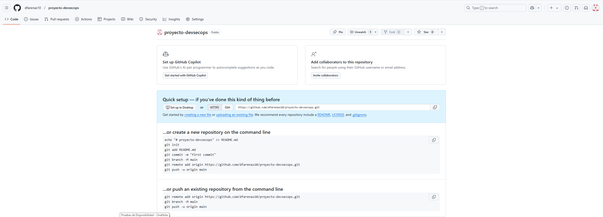


## Download Locally

Clone the project

```bash
  git clone https://github.com/dfarenas10/proyecto-devsecops.git
```

Access the directoty

```bash
  cd proyecto-devsecops
```

Branch creation

```bash
  git checkout -b development
```

Worflow creation

```bash
  cat .github/workflow/devsecops-pipeline.yml
```

add changes in repo

```bash
  git add .github/workflow/devsecops-pipeline.yml
```

add commit in repo

```bash
  git commit -m "Agregado pipeline de Devsecops con Semgrep, dependecy Check y Gitleaks"
```

push in repo

```bash
  git push origin development
```
## Deploying EC2 on AWS**

- Account AWS launch instance

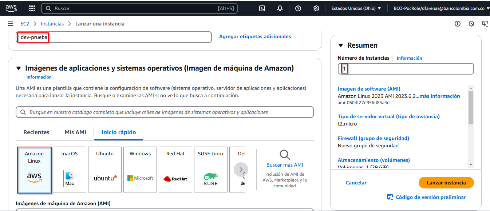

- instance type

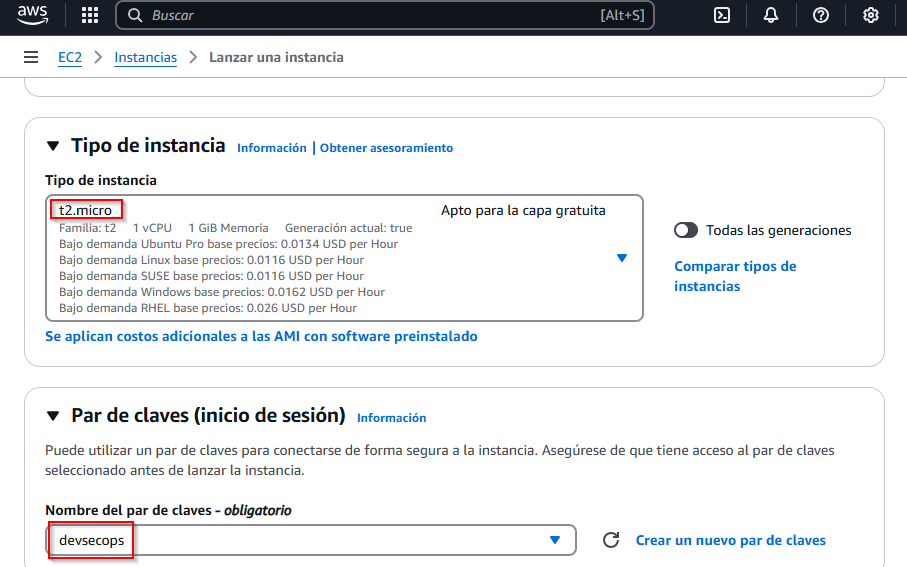

- SSH access to the instance

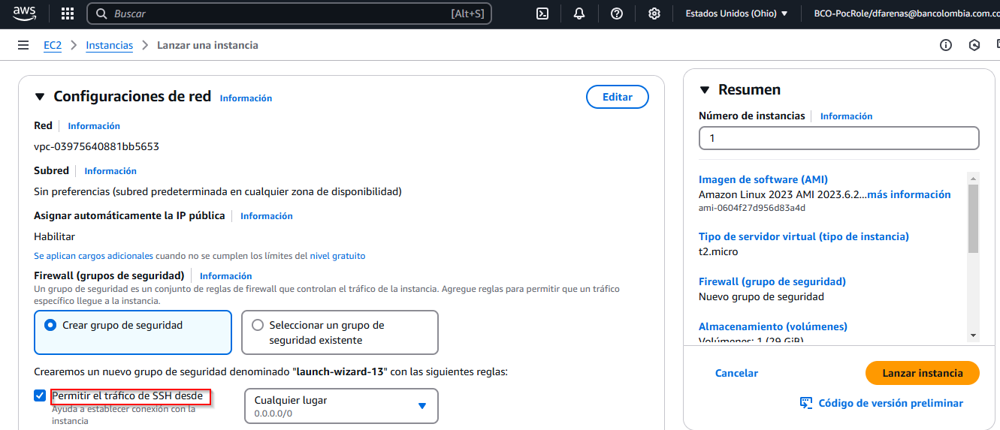

- Change Storage

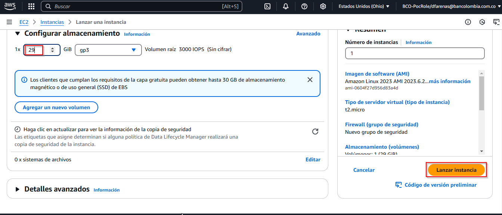

- Add elastic ip addressing

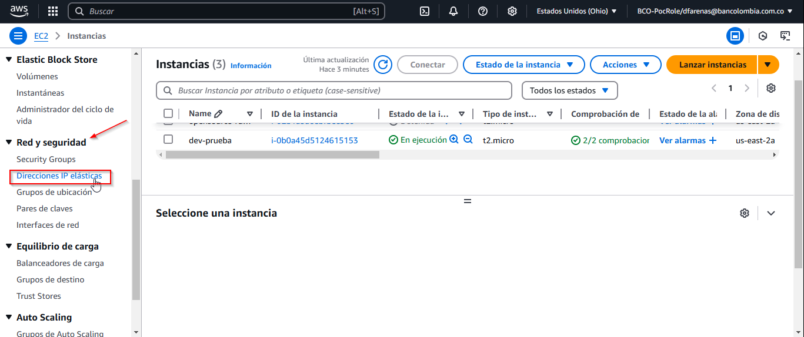

- assign elastic ip address

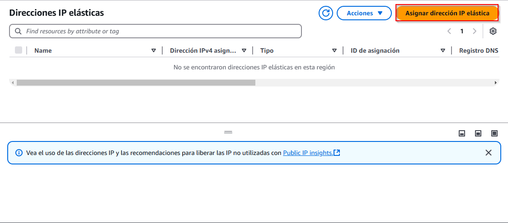

- Click on assign

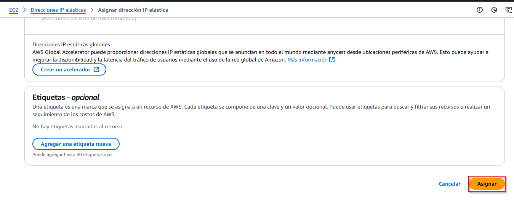

- Correct assignment of the elastic IP

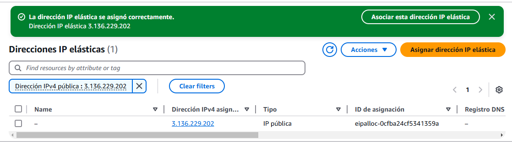

- After creating the elastic IP it is linked to our instance

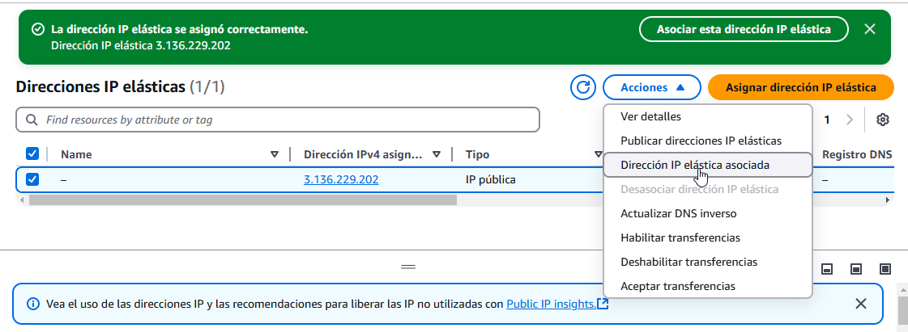

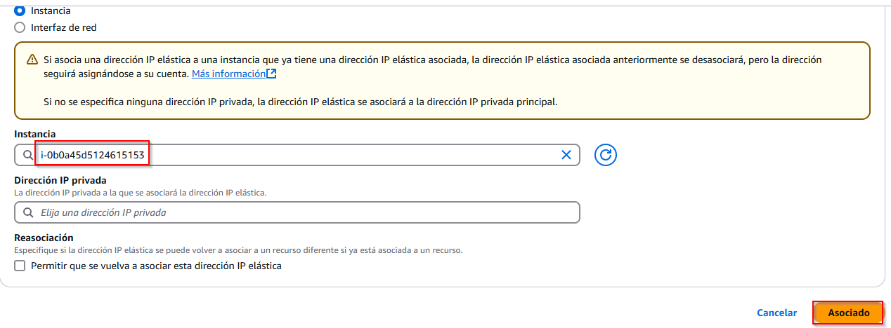

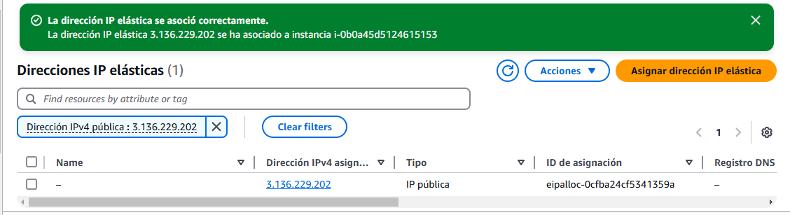


- is associated with the instance

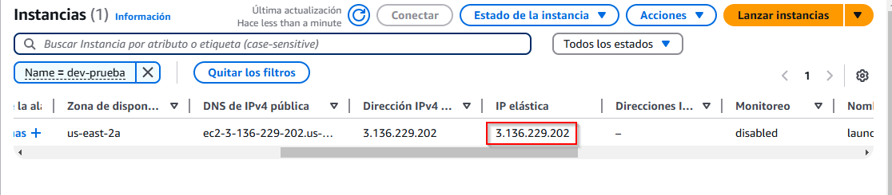


- connection to the instance

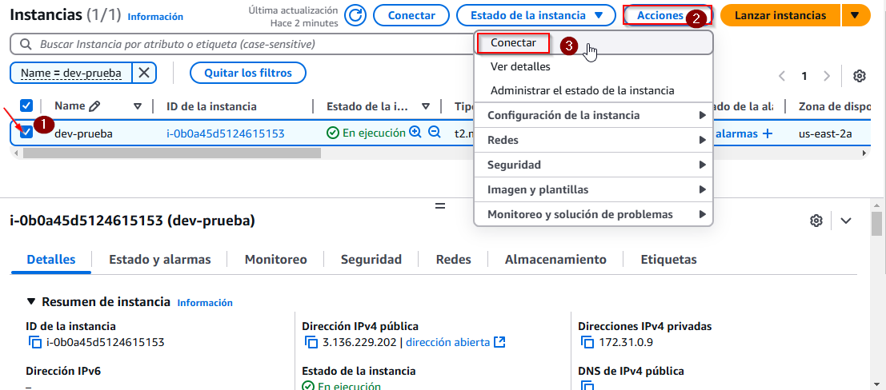


- The instance is accessed and the repositories are updated

```bash
  yum update -y
```

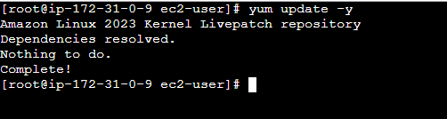


- Proceed with the installation of Docker

```bash
  yum install -y docker git
```

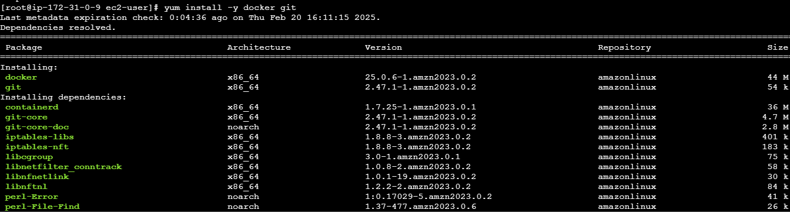
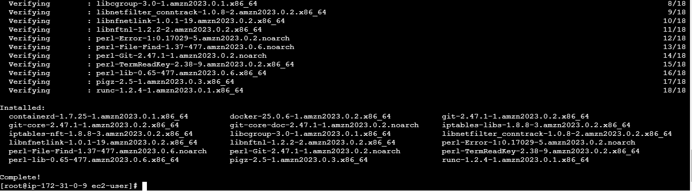

- Docker service is started and activated

```bash
  systemctl start docker
```

```bash
  systemctl enable docker
```

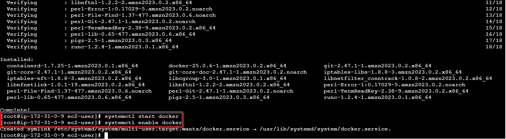

- Defect dojo is cloned into the EC2 instance and the folder is accessede

```bash
  git clone https://github.com/DefectDojo/django-DefectDojo.git
```

```bash
  cd django-DefectDojo
```

```bash
  ls
```

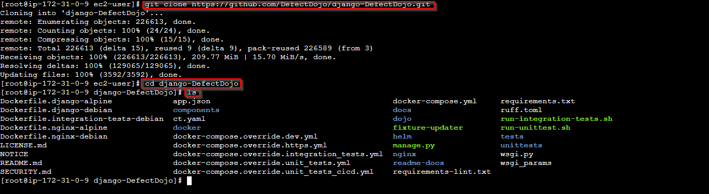

- Services are being raised

```bash
  docker-compose up -d
```

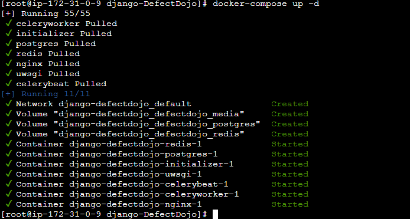

- Inbound rules are added for the security group

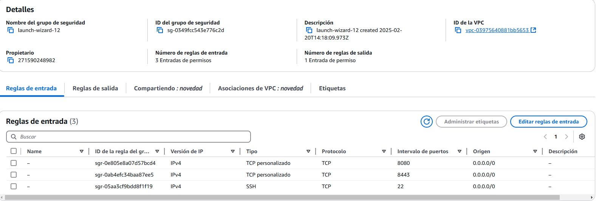

- Products, environments and engagements are created

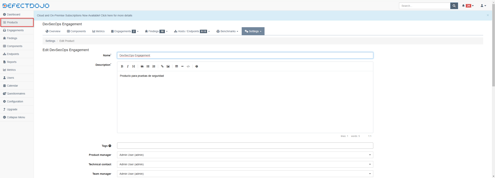

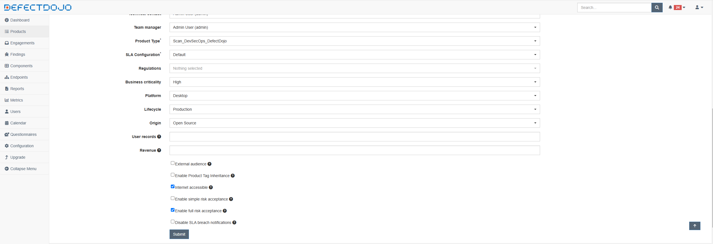

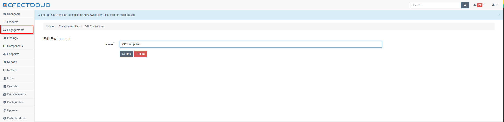

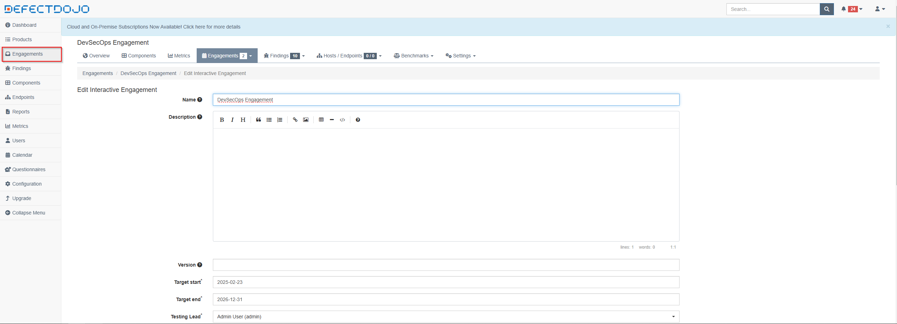

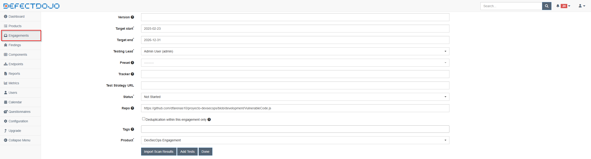

- Code is created in the workflow to validate vulnerabilities

## .yml file configuration

```yml
name: DevSecOps Pipeline

on: [push, pull_request]

jobs:
  semgrep:
    runs-on: ubuntu-latest
    steps:
      - name: Checkout repository
        uses: actions/checkout@v4

      - name: Install Semgrep and jq
        run: |
          pip install semgrep
          sudo apt-get update && sudo apt-get install -y jq
          semgrep --version

      - name: Check and Delete Previous Reports in DefectDojo
        env:
          DEFECTDOJO_URL: ${{ secrets.DEFECTDOJO_URL }}
          DEFECTDOJO_API_KEY: ${{ secrets.DEFECTDOJO_API_KEY }}
          DEFECTDOJO_ENGAGEMENT_ID: ${{ secrets.DEFECTDOJO_ENGAGEMENT_ID }}
        run: |
          reports=$(curl -s -H "Authorization: Token $DEFECTDOJO_API_KEY" "$DEFECTDOJO_URL/api/v2/tests/?engagement=$DEFECTDOJO_ENGAGEMENT_ID" | jq -r '.results[].id')
          for report_id in $reports; do
            curl -X DELETE "$DEFECTDOJO_URL/api/v2/tests/$report_id/" -H "Authorization: Token $DEFECTDOJO_API_KEY"
          done

      - name: Run Semgrep
        run: semgrep scan --config=auto --json > semgrep_report.json || true

      - name: Display Semgrep Results
        run: |
          if [ -s semgrep_report.json ] && [ "$(jq '.results | length' semgrep_report.json)" -gt 0 ]; then
            echo "### Semgrep Vulnerabilities Found:"
            jq -r '.results[] | "| " + (.path // "N/A") + " | " + (.check_id // "N/A") + " | " + (.extra.message // "N/A") + " |"' semgrep_report.json
          else
            echo "No vulnerabilities found in Semgrep."
          fi

      - name: Upload Semgrep Report to DefectDojo
        if: ${{ hashFiles('semgrep_report.json') != '' }}
        env:
          DEFECTDOJO_URL: ${{ secrets.DEFECTDOJO_URL }}
          DEFECTDOJO_API_KEY: ${{ secrets.DEFECTDOJO_API_KEY }}
          DEFECTDOJO_ENGAGEMENT_ID: ${{ secrets.DEFECTDOJO_ENGAGEMENT_ID }}
          DEFECTDOJO_PRODUCT_NAME: "DevSecOps Engagement"
          DEFECTDOJO_ENVIRONMENT: "CI/CD-Pipeline"
        run: |
          if [ "$(jq '.results | length' semgrep_report.json)" -gt 0 ]; then
            curl -X POST "$DEFECTDOJO_URL/api/v2/import-scan/" \
              -H "Authorization: Token $DEFECTDOJO_API_KEY" \
              -H "Content-Type: multipart/form-data" \
              -F "scan_type=Semgrep JSON Report" \
              -F "engagement=$DEFECTDOJO_ENGAGEMENT_ID" \
              -F "product_name=$DEFECTDOJO_PRODUCT_NAME" \
              -F "environment=$DEFECTDOJO_ENVIRONMENT" \
              -F "file=@semgrep_report.json"
          fi

  trivy:
    runs-on: ubuntu-latest
    steps:
      - name: Checkout repository
        uses: actions/checkout@v4

      - name: Install Trivy
        run: |
          sudo apt-get install -y wget
          TRIVY_LATEST_VERSION=$(curl -s https://api.github.com/repos/aquasecurity/trivy/releases/latest | jq -r '.tag_name' | sed 's/v//')
          wget "https://github.com/aquasecurity/trivy/releases/download/v${TRIVY_LATEST_VERSION}/trivy_${TRIVY_LATEST_VERSION}_Linux-64bit.tar.gz"
          tar zxvf "trivy_${TRIVY_LATEST_VERSION}_Linux-64bit.tar.gz"
          sudo mv trivy /usr/local/bin/
          trivy --version

      - name: Run Trivy
        run: trivy filesystem --format json --output trivy_report.json . || true

      - name: Display Trivy Results
        run: |
          if [ -s trivy_report.json ] && [ "$(jq '.Results | length' trivy_report.json)" -gt 0 ]; then
            echo "### Trivy Vulnerabilities Found:"
            jq -r '.Results[]?.Vulnerabilities[]? | "| " + (.VulnerabilityID // "N/A") + " | " + (.PkgName // "N/A") + " | " + (.Severity // "N/A") + " |"' trivy_report.json
          else
            echo "No vulnerabilities found in Trivy."
          fi

      - name: Upload Trivy Report to DefectDojo
        if: ${{ hashFiles('trivy_report.json') != '' }}
        env:
          DEFECTDOJO_URL: ${{ secrets.DEFECTDOJO_URL }}
          DEFECTDOJO_API_KEY: ${{ secrets.DEFECTDOJO_API_KEY }}
          DEFECTDOJO_ENGAGEMENT_ID: ${{ secrets.DEFECTDOJO_ENGAGEMENT_ID }}
          DEFECTDOJO_PRODUCT_NAME: "DevSecOps Engagement"
          DEFECTDOJO_ENVIRONMENT: "CI/CD-Pipeline"
        run: |
          if [ "$(jq '.Results | length' trivy_report.json)" -gt 0 ]; then
            curl -X POST "$DEFECTDOJO_URL/api/v2/import-scan/" \
              -H "Authorization: Token $DEFECTDOJO_API_KEY" \
              -H "Content-Type: multipart/form-data" \
              -F "scan_type=Trivy Scan" \
              -F "engagement=$DEFECTDOJO_ENGAGEMENT_ID" \
              -F "product_name=$DEFECTDOJO_PRODUCT_NAME" \
              -F "environment=$DEFECTDOJO_ENVIRONMENT" \
              -F "file=@trivy_report.json"
          fi

  gitleaks:
    runs-on: ubuntu-latest
    steps:
      - name: Checkout repository
        uses: actions/checkout@v4

      - name: Install Gitleaks
        run: |
          GITLEAKS_VERSION=$(curl -s https://api.github.com/repos/gitleaks/gitleaks/releases/latest | jq -r '.tag_name')
          wget -O gitleaks.tar.gz "https://github.com/gitleaks/gitleaks/releases/download/${GITLEAKS_VERSION}/gitleaks_${GITLEAKS_VERSION#v}_linux_x64.tar.gz"
          tar -xzf gitleaks.tar.gz
          sudo mv gitleaks /usr/local/bin/
          gitleaks version

      - name: Run Gitleaks
        run: gitleaks detect -r gitleaks_report.json --format json || true

      - name: Display Gitleaks Results
        run: |
          if [ -s gitleaks_report.json ] && [ "$(jq '.leaks | length' gitleaks_report.json)" -gt 0 ]; then
            echo "### Gitleaks Vulnerabilities Found:"
            jq -r '.leaks[] | "| " + (.file // "N/A") + " | " + (.line // "N/A") + " | " + (.rule // "N/A") + " |"' gitleaks_report.json
          else
            echo "No vulnerabilities found in Gitleaks."
          fi

```

- Secrets are added to GitHub to establish communication with the .yml

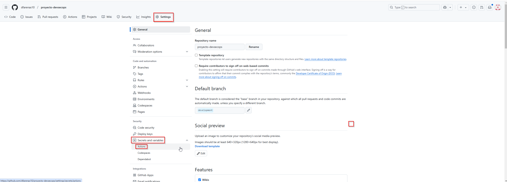

`DEFECTDOJO_API_KEY`

`DEFECTDOJO_ENGAGEMENT_ID`

`DEFECTDOJO_ENVIRONMENT`

`DEFECTDOJO_PRODUCT_NAME`

`DEFECTDOJO_URL`

`NVD_API_KEY`

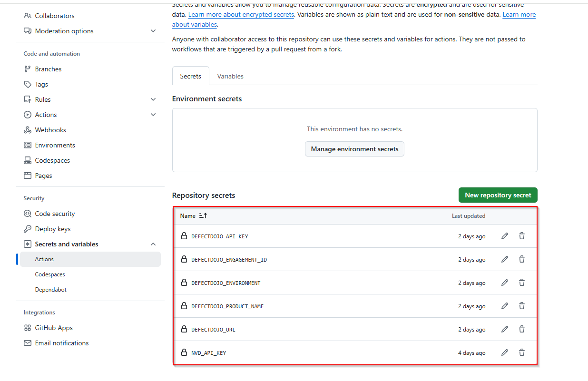


- **When a push is made to the repository, the pipeline is executed**

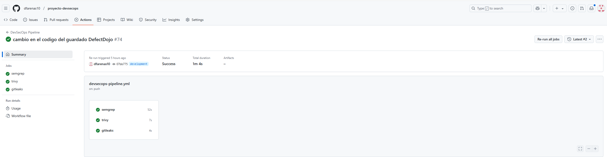

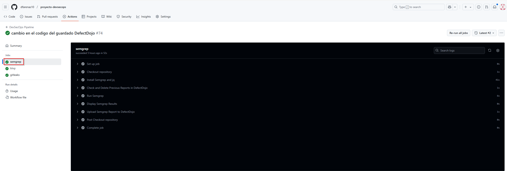

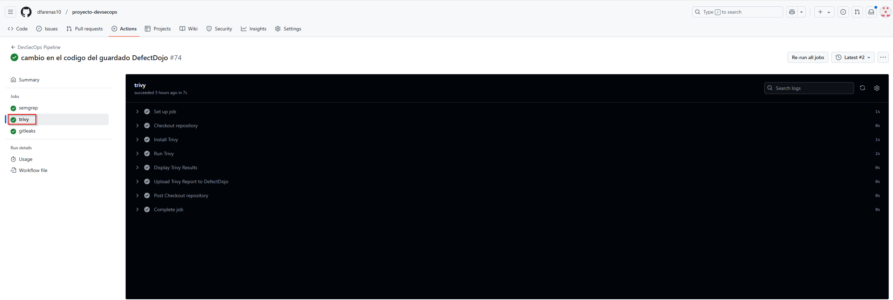

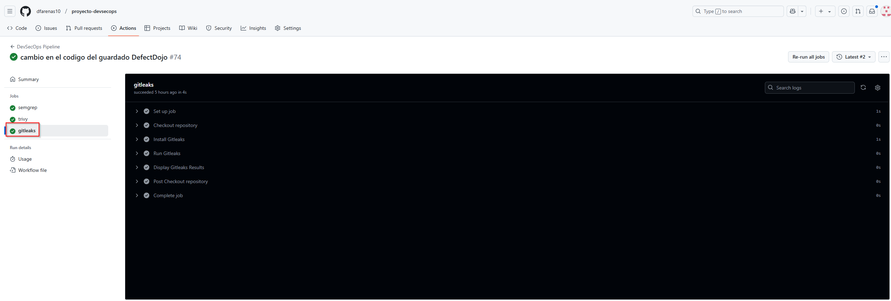

- **Report DefectDojo**

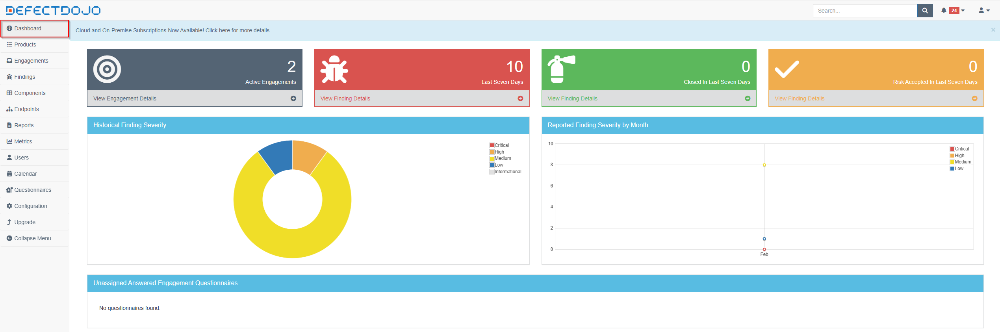

#**Summary**

**1. Prácticas de DevSecOps validadas**
El pipeline está validando las siguientes prácticas de seguridad:

**SAST (Static Application Security Testing):**

- **Semgrep:** Analiza el código fuente en busca de patrones de seguridad y malas prácticas.

- **Gitleaks:** Escanea el repositorio en busca de secretos expuestos (credenciales, tokens, etc.).

**SCA (Software Composition Analysis):**

- **Trivy:** Analiza las dependencias del código en busca de vulnerabilidades conocidas en paquetes de terceros.

**2. ASPM utilizado (Application Security Posture Management)**
El pipeline está utilizando DefectDojo como ASPM para la gestión centralizada de vulnerabilidades detectadas en los escaneos de seguridad.

**Funcionalidades utilizadas de DefectDojo:**
- Se integran los reportes de Semgrep, Trivy y Gitleaks.
- Se eliminan reportes previos antes de subir nuevos.
- Se organiza la información en el engagement "CI/CD-Pipeline".

**Manejo en DefectDojo:**

Como DefectDojo permite asignar niveles de riesgo a las vulnerabilidades, la estrategia de priorización podría depender de la configuración en DefectDojo y de reglas adicionales que se apliquen manualmente o mediante automatización.


## Authors

- [Daniel Felipe Arenas Arango](https://github.com/dfarenas10/proyecto-devsecops)

